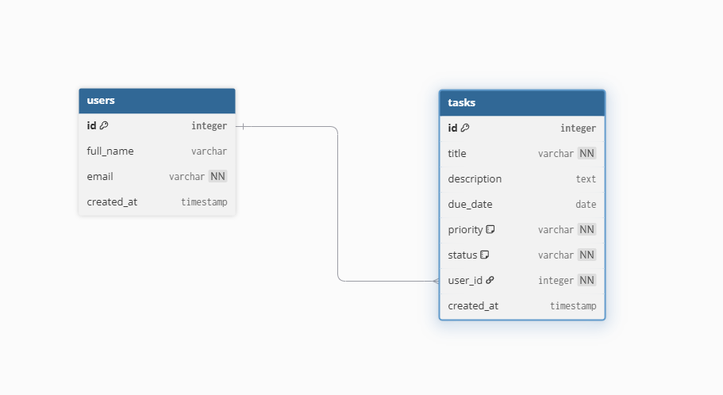

# Entity Relationship Diagram

Reference the Creating an Entity Relationship Diagram final project guide in the course portal for more information about how to complete this deliverable.

## Create the List of Tables

- users
- tasks

## Add the Entity Relationship Diagram

### Table: users

| Column Name | Type      | Description                     |
| ----------- | --------- | ------------------------------- |
| id          | integer   | primary key                     |
| full_name   | varchar   | user's full name                |
| email       | varchar   | user email (unique)             |
| created_at  | timestamp | timestamp when user was created |

---

### Table: tasks

| Column Name | Type      | Description                        |
| ----------- | --------- | ---------------------------------- |
| id          | integer   | primary key                        |
| title       | varchar   | task title                         |
| description | text      | detailed description of the task   |
| due_date    | date      | due date                           |
| priority    | varchar   | task priority (high, medium, low)  |
| status      | varchar   | task status (pending or completed) |
| user_id     | integer   | foreign key referencing users.id   |
| created_at  | timestamp | timestamp when task was created    |

---

### Entity Relationship Diagram

