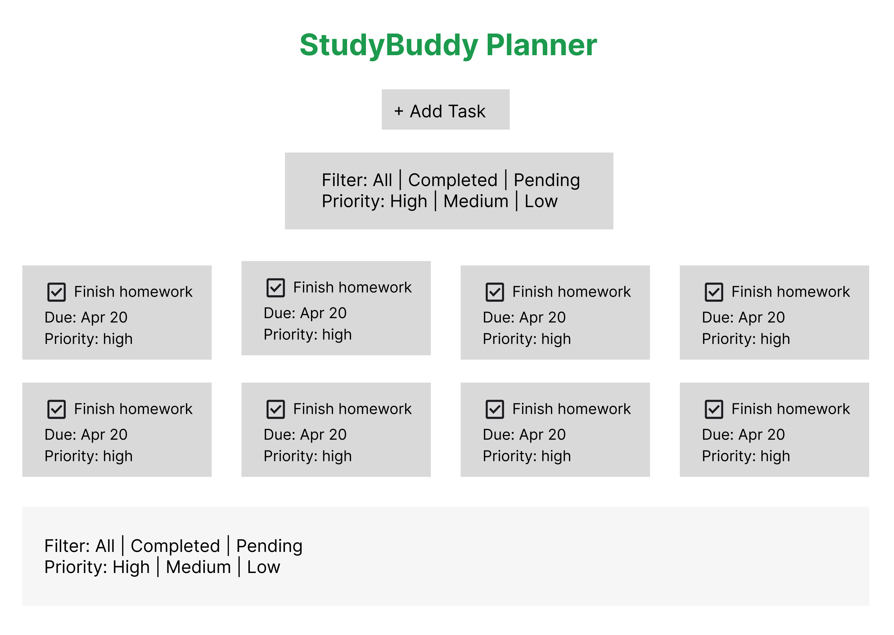
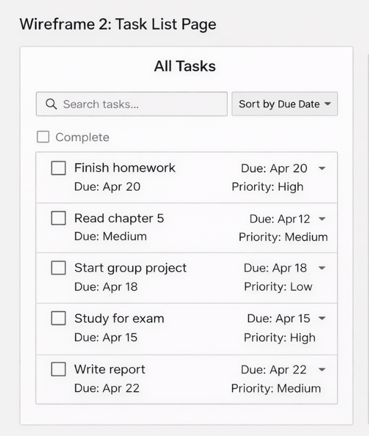
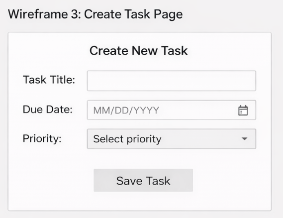

# Wireframes

Reference the Creating an Entity Relationship Diagram final project guide in the course portal for more information about how to complete this deliverable.

## List of Pages

- ⭐ Dashboard Page
- ⭐ Task List Page
- ⭐ Create/Edit Task Page

## Wireframe 1: Task Dashboard

- Displays all tasks
- Filter by priority and status
- Button: Add Task
- Checkbox: Mark task as completed

## Wireframe 2: Task List Page

- List of all tasks
- Sorting and filtering options
- Shows task title, due date, and priority

## Wireframe 3: Create/Edit Task Page

- Input: Task title
- Input: Due date
- Dropdown: Priority (high, medium, low)
- Button: Save Task

